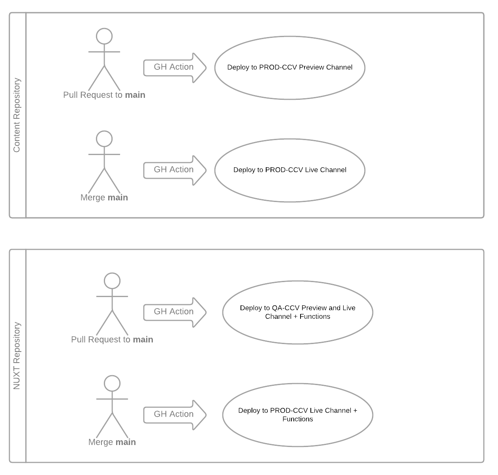

# CCV's Website

Developed in Nuxt.js, deployed to firebase. 

## General Set Up

Our website is partly static and partly dynamic. The static content is mostly handled via [Nuxt Content](https://content.nuxtjs.org) and it lives in the [ccv-website-content repository](https://github.com/brown-ccv/ccv-website-content). Generally, our members will contribute to the content repository. Only structural contributions are handled in this repo. The content repo is included here as a git submodule for development/deployments purposes only. Content should not be modified within here (except for testing purposes).

We use `nuxt generate` in conjunction with Firebase static hosting to serve our static content. During the build process `nuxt generate` places all static html pages into the `dist` folder. If a route is found in the `dist` folder, Firebase serves that, if a route is not found, we rely on cloud functions to handle the reminder of the routes.

The part of [Firebase's configuration](firebase.json) that makes this happen is 

```
"rewrites": [
{
    "source": "**",
    "function": "ssrapp"
}
],
```

In order to handle our 404 page correctly, we control which routes are served dynamically by the Nuxt app. As of (7-22-2022), the only dynamic routes configured in [functions/index.js](functions/index.js) are:

```
let dynamicRoutes = ['/_ghapi/status', '/_workday/opportunities']
```

All other routes that are not included on that list or in the `dist` folder are redirected to a pre-generated `404.html`. By default, Nuxt does not generate a `404.html` (only a 404.vue), to get the html page, we added the following block in the config.

```
  generate: {
    fallback: "404.html"
  },
```

## GitHub Actions

There are two main workflows:

1. When a PR is opened against the main branch, we deploy to qa-ccv-brown-edu live and preview channels.
   There is no such thing as "preview" functions, so if the changes include changes to the functions, one needs to check qa-ccv-brown-edu.web.app (main channel). If the changes are only to static pages, then the preview channel will reflect the changes appropriately.
2. When a PR is merged to the main branch, we deploy to ccv-brown-edu (live channel and functions)



## Local Dev Setup

```bash
# install dependencies
$ npm install

# initialize the content submodule
git submodule update --init

# update the content to point to HEAD of remote tracking branch
# this is optional, there is a post-merge hook that calls this,
# but you can trigger on demand to make sure content is up-to-date
git submodule update --remote

# serve with hot reload at localhost:3000
$ npm run dev
```

You'll need an .env file with the below keys (token needs full repo access to ccv-status) for the status banner to work (will gracefully degrade in dev mode if not available):

```
GITHUB_USER=
GITHUB_TOKEN=
```

## Testing build set up

In deployment, the dynamic routes are served by Firebase functions. To simulate this behavior, we need to run through the entire build process, which asks Nuxt to generate the static routes and firebase to emulate the functions

```
npm install -g firebase-tools #if needed
npm run fn-install # if needed
npm run local-deploy
```

**Note:**
* 2022-06-23 (MIR): Our local-deploy uses `firebase serve` which seems to not be recommended anymore. We'll probably need to run the functions emulator instead. 

## Useful guides

Main guide used :
* [Nuxt.js docs](https://nuxtjs.org).
* https://github.com/benmayer/nuxt-ssr-firebase-template
With it's corresponding post
* https://ben-mayer.com/blog/building-a-web-app-using-nuxtjs-and-firebase

Other useful
* https://stackoverflow.com/questions/61060666/how-to-deploy-nuxt-ssr-app-to-firebase-through-cloud-functions
* https://dev.to/slushnys/how-to-host-nuxt-js-application-on-firebase-with-a-single-command-1nio


## Notes

* 2021-05-26 (MCM): sass-loader stuck at 10 and webpack at 4 due to nuxt
